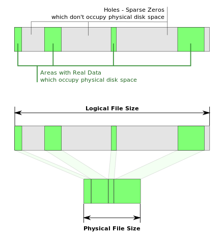

# Issue
Ambari Docker image를 구축하는 과정에서, **Macbook에서 실행시 Docker image가 지나치게 커지는 상황**을 경험했다.
이상한 점은, **WSL(Windows Subsystem for Linux) Ubuntu에서 빌드할 때는 300MB 언저리였지만, Mac OS에서 실행하니 무려 80GB넘어갔고, 빌드 시간도 1분이면 완료될 것이 한 시간이 걸리는 상황**이었다.

```bash
 $ ~/PersonalProject/ambari/cluster-db> docker build . -t "cluster-postgres" --build-arg POSTGRES_UID=$UID --build-arg POSTGRES_GID=$GID
Sending build context to Docker daemon  99.78MB
Step 1/4 : FROM postgres:12.4
 ---> 492fb9ae4e7a
Step 2/4 : ARG POSTGRES_GID
 ---> Using cache
 ---> 15ece0ce93b8
Step 3/4 : ARG POSTGRES_UID
 ---> Using cache
 ---> dda4a9b71292
Step 4/4 : RUN groupmod -og $POSTGRES_GID postgres && usermod -u $POSTGRES_UID postgres
 ---> Using cache
 ---> 86660ea7f278
Successfully built 86660ea7f278
Successfully tagged cluster-postgres:latest
 $ ~/PersonalProject/ambari/cluster-db> docker image ls
REPOSITORY          TAG                 IMAGE ID            CREATED             SIZE
cluster-postgres    latest              86660ea7f278        13 minutes ago      80.3GB
postgres            12.4                492fb9ae4e7a        5 weeks ago         314MB
```
build 하려던 이미지는 PostgresQL 기반 이미지이며, 단지 user postgres의 **UID 와 GID를 변경했을 뿐**이었다.
```dockerfile
FROM postgres:12.4

ARG POSTGRES_GID
ARG POSTGRES_UID

RUN groupmod -og $POSTGRES_GID postgres && usermod -u $POSTGRES_UID postgres
```
참고로 postgres이미지는 약 300MB로, 이 이미지도 큰 차이가 없어야 하는게 정상이다.
두 상황(WSL ubuntu, MacOS)에서 다른 점은 전달되는 Argument `POSTGRES_GID`, `POSTGRES_UID`뿐이다.

| OS  | POSTGRES_GID | POSTGRES_UID | 
| --- | ------------ | ------------ |
WSL ubuntu | 765(기억안나지만 백단위) | 1000
Mac OS | 177382780 | 247012762


# 이 트러블 슈팅이 유용한 상황
- why my docker image is huge
- why my docker build gets stuck in useradd/usermod

# Related Issue
- [Huge Docker file and `tar` behavior](https://superuser.com/questions/1178073/huge-docker-file-and-tar-behavior)
- [docker build hangs/crashes when useradd with large UID #5419
](https://github.com/moby/moby/issues/5419) in moby

내 상황과 비슷한 질문과 답변을 통해 이는 [Sparse file](https://en.wikipedia.org/wiki/Sparse_file), [`/var/log/lastlog`](https://en.wikipedia.org/wiki/Lastlog) 과 관련되었다는 것을 알게되었다.

빌드된 이미지를 실행하고 용량을 체크해본 결과 두 파일이 비정상적으로 컸다.
```bash
root@c8a4e3939d80:/var/log# du -sh *
...
7.4G	faillog
68G	lastlog
...
```

구글링하다보면, 이 파일 사이즈로 인해 생긴 이슈로 올린 질문들이 꽤 있다.

# Sparse file
`Sparse file`은 부분적으로 데이터가 없는 파일을 효율적으로 이용하기 위한 파일 타입이다.
주로 disk image, database snapshot 또는 log file에서 사용하며, 미리 데이터 사이즈를 잡아두어 `ls`등으로 보면 아무것도 없는 데이터인데 비교적 큰 사이즈를 가지고 있지만, 실제로는 해당 사이즈를 차지하고 있지 않으며 나중에 채워질 수 있는 파일이다.  
만약 내 디스크에 남은 용량이 20GB에 없어도 새로운 100GB의 Sparse file을 만들 수 있다. 왜냐하면 실제로 100GB를 차지하지 않고 있기때문이며(물론 실제 데이터가 20GB를 넘어가는 순간 당연히 에러를 맞이하게 될 것이다) [Wiki의 이미지](https://en.wikipedia.org/wiki/Sparse_file)가 매우 직관적이므로 이를 첨부한다.  



# Lastlog & Faillog
## Lastlog
[man lastlog page](https://linux.die.net/man/8/lastlog)에 따르면 `/var/log/lastlog` 는 각 유저의 마지막 로그인 정보를 기록하고 있다.  
또한 다음과 같이 데이터베이스라고 설명하고 있는데
```
The lastlog file is a database which contains info on the last login of each user. ...중략... 
It is a sparse file, so its size on the disk is usually much smaller than the one shown by "ls -l" (which can indicate a really big file if you have in passwd users with a high UID). You can display its real size with "ls -s".
```
중요한 점은 sparse file로 `ls -l`로 보여지는 사이즈보다 실제로는 적게 차지한다고 한다.  
또한 만약 유저가 높은 UID값(나와 같은 경우)은 파일이 크게 보이지만 `ls -s`로 보면 실제 사이즈(매우 적음)를 볼 수 있다고 한다

## Faillog
[man faillog page](https://man7.org/linux/man-pages/man5/faillog.5.html)에 따르면 `/var/log/faillog`는 유저의 로그인 실패 횟수, 최대로 허용되는 실패 횟수등을 관리하는 데이터라고 한다.
중요한 점은
```
The file contains fixed length records, indexed by numerical UID.
```
UID로 인덱스 되는 고정된 크기의 레코드라는 것이다.  
즉 UID가 큰 값이면 이 고정된 크기 역시 매우 크게 된다는 점이다.  
다만 man에서는 faillog가 `sparse file`이라는 점을 언급하지 않았다.

# User id와 sparse file 그리고 Lastlog의 관계
[man lastlog](https://linux.die.net/man/8/lastlog)에 따르면 주의사항으로, **User ID gap이 크면 어떠한 출력도 없이 lastlog의 실행시간을 늘려버릴 수 있다**고 경고한다.
```
Large gaps in UID numbers will cause the lastlog program to run longer with no output to the screen (i.e. if in lastlog database there is no entries for users with UID between 170 and 800 lastlog will appear to hang as it processes entries with UIDs 171-799).
```
나의 경우, user list를 보니, Hang이 걸릴 수 밖에 없는 user gap이 있었다.
```
_apt:x:100:65534::/nonexistent:/usr/sbin/nologin
postgres:x:247012762:177382780::/var/lib/postgresql:/bin/bash
```
user 999(Postgres user id)를 247012762로 변경하는데 왜 Hang이 걸렸는지 이해가 갔다.

여기서 lastlog의 구조는 id 0부터 max id까지 연속적인 자료구조로 예상된다.

좀 더 구글링해보니 꽤 [간단 명료한 답변](https://unix.stackexchange.com/questions/529827/is-there-a-reason-why-var-log-lastlog-is-a-huge-sparse-file-1-1tb)을 찾을 수 있었는데, 요약하면 다음과 같다.

lastlog는 array이며 다음과 같은 구조체이다.
```c
struct lastlog {
    time_t  ll_time;    // 4
    char    ll_line[UT_LINESIZE];   // 32
    char    ll_host[UT_HOSTSIZE];   // 256
} entry[UINT_MAX];
```
한 User의 데이터는 4 + 32 + 256 = 292byte이며 user login 정보를 조회할 경우 아래와 같이 접근하며 O(1)의 시간 복잡도로 매우 빠르게 조회할 수 있다.
```
uid * sizeof(struct lastlog)
```
내 경우에는 최대 UID가 247012762이므로, 대략 계산해보면, 247012762이므로 * 292 = 67.17GB로 위에서 보았던 용량과 거의 일치한다.

한편, [faillog man page](https://man7.org/linux/man-pages/man5/faillog.5.html)를 살펴보면 faillog의 구조체를 확인할 수 있다.
```c
struct    faillog {
    short   fail_cnt;
    short   fail_max;
    char    fail_line[12];
    time_t  fail_time;
    long    fail_locktime;
};
```
이것도 대략 계산하면 7.4G를 차지한 것도 말이 된다.

# 해결방법
## -l option for useradd
`useradd`의 manual을 보면 log를 사용하지 않도록 할 수 있는 옵션이 있다.
```
-l, --no-log-init
Do not add the user to the lastlog and faillog databases.
```
따라서 `useradd`는 간단하게 해결할 수 있다.
그렇다면 `usermod`는 이 옵션이 있을까? 없다

## how to resolve this issue for usermod

### Option 1. userdel && useradd
여러가지 방법이 있겠지만 나는 `userdel`로 유저를 삭제후 `useradd -l`로 다시 만들어주는 방법이 있다.
```dockerfile
RUN userdel postgres && groupadd postgres -g $POSTGRES_GID && useradd -l -u $POSTGRES_UID postgres -g $POSTGRES_GID
```
결과는 예상했던대로 Postgres image와 차이가 없었다
```bash
 $> ~/PersonalProject/ambari/cluster-db> docker image ls
REPOSITORY          TAG                 IMAGE ID            CREATED             SIZE
cluster-postgres    latest              712fbca0247f        7 minutes ago       314MB
```

### Option 2. ln -sfn /dev/null /var/log/lastlog && ln -sfn /dev/null /var/log/faillog
User를 삭제하지 않고싶다면, `lastlog`와 `faillog`를 `/dev/null`로 리다이렉트 시켜버린다.
```dockerfile
  RUN ln -sfn /dev/null /var/log/lastlog && ln -sfn /dev/null /var/log/faillog && groupmod -og $POSTGRES_GID postgres && usermod -u $POSTGRES_UID postgres
```
Image 사이즈 역시 예상했던대로 적게 나왔다.
```bash
 $ ~/PersonalProject/ambari/cluster-db> docker image ls
REPOSITORY          TAG                 IMAGE ID            CREATED             SIZE
cluster-postgres    latest              cf93ece72c3d        5 minutes ago       314MB
```